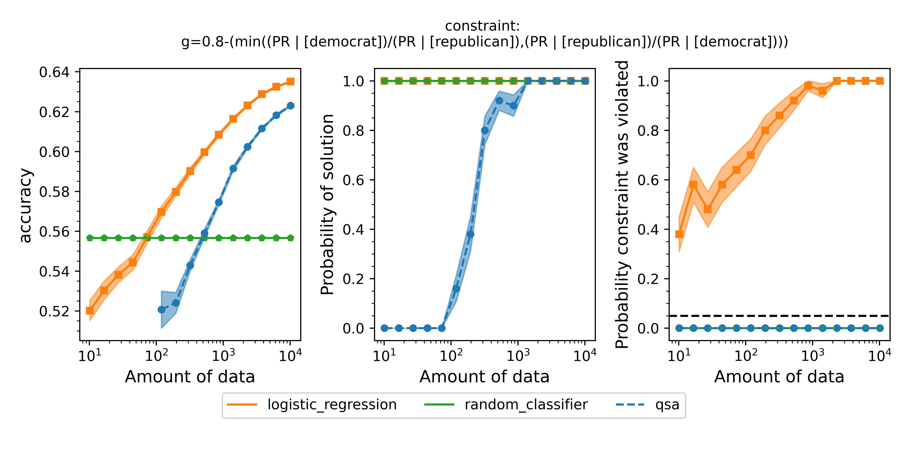

# Fairness for Lie Detection
A tutorial for using Seldonian Algorithms to obtain a fair lie detection model 

## Introduction

Text-based lie detection is a task to predict whether a statement is true based on only textual information. In other words, the system makes predictions without relying on facial expressions, gestures, pitch, or other non-verbal features. Lie detection systems are usually used in certain high-stakes scenarios, such as whether one is lying to the judges or TSA agents. Because the stakes are high, it would be dangerous if the lie detection systems were biased based on sensitive factors like gender or race.

In this tutorial, we show how to use the Seldonian Toolkit to train a fair logistic regression model for text-based lie detection based on different fairness definitions. We use the dataset from the paper ["Liar, Liar Pants on Fire": A New Benchmark Dataset for Fake News Detection](https://aclanthology.org/P17-2067/) (Wang, ACL 2017), which contains around 12,800 political statements corresponding with a six-categories labels and 11 attributes of the speaker. Our goal is to train a binary classification model that makes a fair decision with respect to the party (Democrats and Republicans).

## Dataset preparation

The `preprocess.ipynb` notebook implements the steps described in this section. If you would like to skip this section, you can find the correctly reformatted dataset at `data/proc_data/data.pkl`, which is the end product of the notebook.

The dataset we used can be downloaded at [here](https://www.cs.ucsb.edu/~william/data/liar_dataset.zip). The zip file contains three TSV files: train set, validation set, and test set. We merge them together into a single Dataframe. The label column (column 2) has six values: "pants-fire", "false", "barely-true", "half-true", "mostly-true", and "true." We discard data points labeled with "half-true", and treat data points labeled with "pants-fire", "false", and "barely-true" as lies, and those with "mostly-true", and "true" as ruth. We discard the columns of ID (column 1), speaker's name (column 5), and subject(s) (column 4) since they are either meaningless or hard to be encoded. We also discard the column of the total credit history count (columns 9-13) because of the i.i.d. assumption of Seldonian Algorithms. For the columns of the speakers' job (column 6), party (column 8), state (column 7), and the statement's context (column 14), we one-hot encode each of them into a maximum of 20 categories. 

In order to feed the statement into a logistic regression model rather than only using the categorical features described above, we represent each statement with LIWC (Linguistic Inquiry and Word Count), which is a psycholinguistic dictionary that groups words into 75 categories, and has been used to detect lies in multiple deception studies. Specifically, for each statement $s$, we encode it as $[u_1,...,u_75]$, where $$u_i=\frac{1}{|s|}\sum_j^{|C_i|}v(S, i, j)$$ denotes the coverage rate of the $i$th word category with respect to the statement. The function $v(\cdot,i,j)$ measures the occurrence count of word $w_{i,j}\in C_i$, and $|s|$ represents the number of tokens in $s$. We also calculate the "number of words per sentence", "number of words with 6+ letters", and "word count" as features. 

We create two new binary-value columns, "democrat" and "republican", to denote whether the speaker is a Democrat or Republican as sensitive features. These two columns are not used for model training.

In total, we have 159 features per statement. We save the Dataframe as a pickle (`.pkl`) file.

## Formulate the Seldonian ML problem

We consider four different definitions of fairness to apply to the problem of predicting whether statements are lies or not. The four definitions and their constraint strings are:
1. Disparate impact: '$\min((\mathrm{PR} | [\mathrm{democrat}])/(\mathrm{PR} | [\mathrm{republican}]),(\mathrm{PR} | [\mathrm{republican}])/(\mathrm{PR} | [\mathrm{democrat}])) \geq \epsilon$'
2. Equalized odds: '$\min((\mathrm{FNR} | [\mathrm{democrat}])/(\mathrm{FNR} | [\mathrm{republican}]),(\mathrm{FNR} | [\mathrm{republican}])/(\mathrm{FNR} | [\mathrm{democrat}])) \geq \epsilon$'
3. Predictive equality: '$\min((\mathrm{FPR} | [\mathrm{democrat}])/(\mathrm{FPR} | [\mathrm{republican}]),(\mathrm{FPR} | [\mathrm{republican}])/(\mathrm{FPR} | [\mathrm{democrat}])) \geq \epsilon$'
4. Overall accuracy equality: '$\min((\mathrm{ACC} | [\mathrm{democrat}])/(\mathrm{ACC} | [\mathrm{republican}]),(\mathrm{ACC} | [\mathrm{republican}])/(\mathrm{ACC} | [\mathrm{democrat}])) \geq \epsilon$'

We try 0.8, 0.9, 0.95 as different $\epsilon$, and apply each of these constraints independently, each with $\delta = 0.05$

## Creating the specification object

In `createSpec.py`, we create a different spec object for each constraint to run 12 experiments (4 fairness definitions times 3 epsilon values). We make these spec objects using a for loop and save them in `data/spec`. 

Running this code should print out that the 12 spec files have been created.

## Running a Seldonian Experiment

In `generate_experiment_plot.py`, we run a Seldonian Experiment with a quasi-Seldonian model, a baseline logistic regression model, and a random classifier baseline model. The performance metric is accuracy. The code takes two inputs, the first one is the constraint name, which should be chosen from `['disparate_impact', 'predictive_equality', 'equal_opportunity', 'overall_accuracy_equality']`, and the second one is the $\epsilon$ chosen from `[0.8, 0.9, 0.95]`.

Running the script for each constraint will produce the following plots:

**Figure 1**: Seldonian Experiments using disparate impact as the definition of fairness. Each row is the result with a different $\epsilon$. From top to bottom: $\epsilon=0.8,0.9,0.95$. 

**Figure 2**: Seldonian Experiments using predictive equality as the definition of fairness. Each row is the result with a different $\epsilon$. From top to bottom: $\epsilon=0.8,0.9,0.95$.

**Figure 3**: Seldonian Experiments using equal opportunity as the definition of fairness. Each row is the result with a different $\epsilon$. From top to bottom: $\epsilon=0.8,0.9,0.95$.

**Figure 4**: Seldonian Experiments using overall accuracy equality as the definition of fairness. Each row is the result with a different $\epsilon$. From top to bottom: $\epsilon=0.8,0.9,0.95$.

For each $\epsilon$ and the definition of fairness, a Seldonian Experiment creates three plots, accuracy (left), solution rate (middle), and failure rate (right). The colored points and bands in each panel show the mean standard error over 50 trials. We compare a logistic regression model learned with a quasi-Seldonian algorithm (qsa, blue) to a logistic regression baseline (orange) and a random classifier (green).

## Discussion

All the plots show that although the QSA requires the most samples to return a solution and achieve optimal accuracy, it is the only model that always satisfies the fairness constraints regardless of the number of samples. In addition, except for the experiment using overall accuracy equality as the definition of fairness, the logistic regression model violates the fairness constraint most of the time. Moreover, the violation rate increases when we increase the number of samples for training. Because increasing the number of samples improves model accuracy, these findings suggest that the logistic regression model's high accuracy may not be due to its ability to differentiate lies and truth based on statements. Instead, it may pay too much attention to the party the speakers belong to. The QSA, on the other hand, is fair but also has a high accuracy, implying that its decision may be more dependent on the statement itself.

A special case occurs when overall accuracy equality is used as the definition of fairness. In this case, both the logistic regression model and the QSA satisfy the fairness constraint. Moreover, the QSA outperforms the logistic regression model at the end. This result suggests that a Seldonian algorithm may sometimes obtain a solution closer to the optimal one.

## Summary

In this tutorial, we demonstrated how to use the Seldonian Toolkit to build a predictive model that enforces a variety of fairness constraints on the text-based lie detection dataset. We covered how to construct the dataset and metadata so that they can be used by the Seldonian Experiment. We then ran Seldonian Experiments to evaluate the true performance and safety of the QSA. We found that the QSA can satisfy a range of custom-defined fairness constraints and that the model does not violate the constraints. We compared the QSA to a logistic regression model and found that the performance of the QSA approaches the performance of a logistic regression model that lacks constraints. The logistic regression model frequently violate the constraints for most of the fairness definitions. 